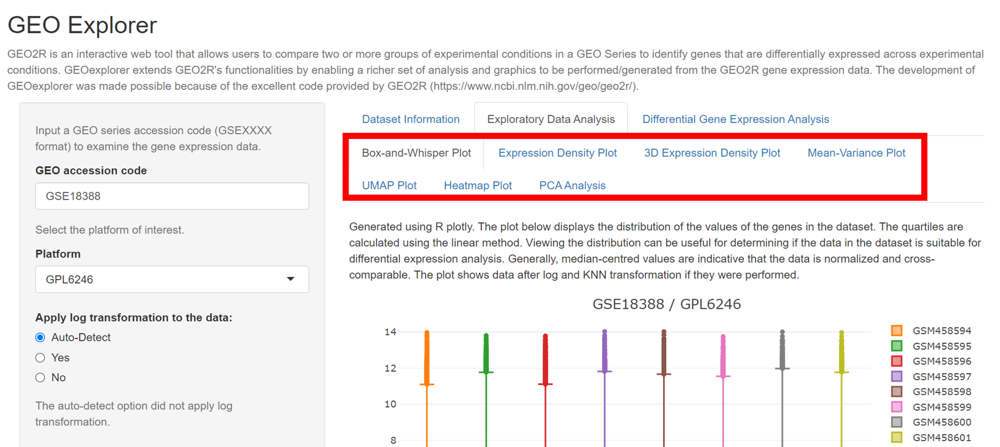

```{r, include = FALSE}
knitr::opts_chunk$set(
  collapse = TRUE,
  comment = "#>"
)
```

# Introduction

GEOexplorer is a Shiny app that enables exploratory data analysis and
differential gene expression analysis to be performed on microarray gene
expression GEO series datasets held in the GEO database. The outputs are
both non-interactive and interactive visualisations which enable users
to explore the results. The development of GEOexplorer was made possible
because of the excellent code provided by GEO2R (https:
//www.ncbi.nlm.nih.gov/geo/geo2r/).

# Installation

```{r eval=FALSE}
if (!requireNamespace("BiocManager", quietly = TRUE))
    install.packages("BiocManager")

BiocManager::install("GEOexplorer")
```

Or GEOexplorer can be installed from GitHub

```{r eval=FALSE}
if (!requireNamespace("devtools", quietly = TRUE))
  install.packages("devtools")

devtools::install_github("guypwhunt/GEOexplorer")
```

# Getting Started using the GEOexplorer Shiny App

Getting started with the GEOexplorer Shiny App is relatively easy and
can be performed in a number of steps.

Step 1: Load the package

```{r loadLibrary}
library(GEOexplorer)
```

Step 2: Launch the Shiny App in a browser.

```{r}
loadApp()
```

# Performing Exploratory Data Analysis

Step 1: After loading the Shiny app, input a microarray GEO series
accession code (with the format GSExxxxx) into "GEO accession code"
field, as per the image 1.

Step 2: Select the platform you wish to analyse from the drop down, as
per the image 1.

Step 3: Select if you want log transformation to be applied, not applied
or for GEOexplorer to determine if log transformation should be applied
to the expression data, as per the image 1.

Image 1:


Step 4: Select if you want missing data to be estimated using KNN
imputation, as per the image 2.

Step 5: Click analyse to perform exploratory data analysis, as per the
image 2.

Image 2:


Step 6: Explore the experiment and expression data in the **Experiment
Information**, **Column Details** and **Dataset** tabs, as per the image
3.

Image 3:


Step 7: View the exploratory data analysis in the **Exploratory Data
Analysis** tab, as per the image 4.

Step 8: Click on the tabs to view the interactive exploratory data
analysis visualisations, as per the image 4. These visualisations give
insights into the trends within the expression data such as the
experimental conditions with similar gene expression profiles. This
information is useful when performing differential gene expression
analysis.

Image 4:


# Performing Differential Gene Expression Analysis

Step 1: After performing exploratory data analysis, click on the
**Differential Gene Expression Analysis** tab, as per the image 1.

Image 1:


Step 2: Click on the **Set Parameters** tab, as per the image 2.

Step 3: Assign each experimental condition into group 1, group 2 or N/A,
as per the image 2. Experimental condition assigned to N/A will not be
included in differential gene expression analysis whilst those assigned
to group 2 will be compared to those assigned to group 1.

Image 2:


Step 4: Select the adjustment to P value from the drop down, as per the
image 3.

Step 5: Select whether to apply limma precision weights, as per the
image 3. The limma precision weights improve the accuracy of
differential gene expression analysis when a strong mean-variance trend
is present as can be identified from the **Mean-Variance Plot** tab.

Step 6: Select whether to force normalisation, as per the image 3.
Forcing normalisation is advisable if the experimental conditions are
not median centred as can be identified from the **Box-and-Whisper
Plot**, **Expression Density Plot** and **3D Expression Density Plot**
tabs.

Step 7: Select the significance cut off, as per the image 3. The cut off
will be used to identify the genes that are under-expressed and the
genes that are over-expressed between the two groups.

Step 8: Click analyse to perform differential gene expression analysis,
as per the image 3.

Image 3:


Step 9: Explore the results of differential gene expression analysis in
the subsequent tabs, as per the image 4.

Image 4:



# Video Demonstration of GEOexplorer

A video demonstrating how to use GEOexplorer's user
interface is available on the following link 
(https://youtu.be/8R8yqMlPCVM).

# Conclusion

The GEOexplorer package provides an easy way to perform exploratory data
analysis and differential gene expression analysis on microarray gene
expression GEO series datasets and provide the outputs as interactive
and non-interactive visualisations.

# Reporting problems or bugs

If you run into problems using GEOexplorer, the [Bioconductor Support
site](https://support.bioconductor.org/) is a good first place to ask
for help. If you are convinced that there is a bug in GEOexplorer, feel
free to submit an issue on the [GEOexplorer github
site](https://github.com/guypwhunt/GEOexplorer). Please include the GEO
accession code that errors and the operating system

# Session info

The following package and versions were used in the production of this
vignette.

```{r echo=FALSE}
sessionInfo()
```
