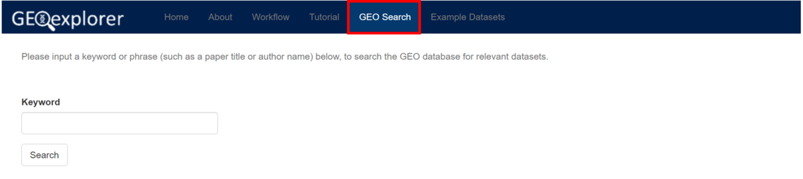
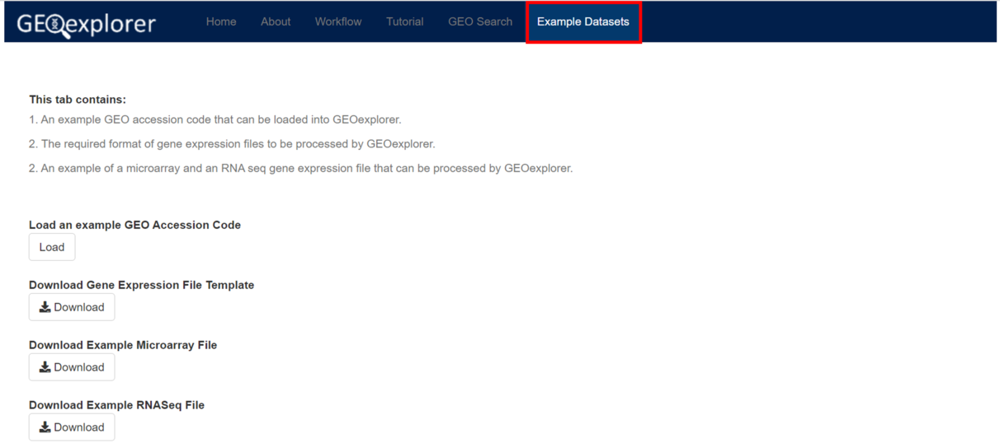
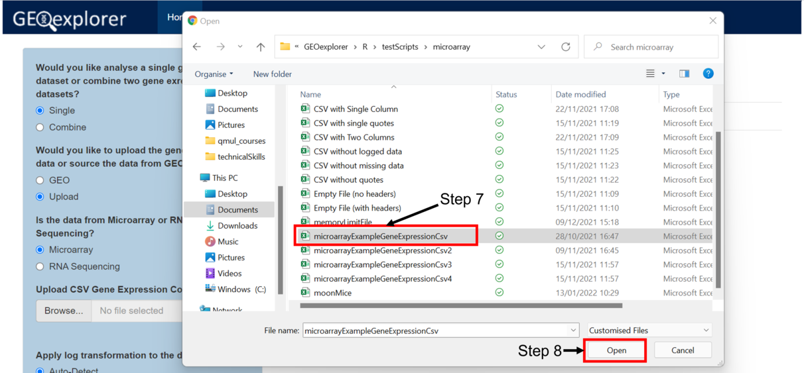

```{r, include = FALSE}
knitr::opts_chunk$set(
  collapse = TRUE,
  comment = "#>"
)
```


# 1. Introduction

GEOexplorer is a web server and R package for the exploration, generation, 
and analysis of transcriptomic datasets. GEOexplorer can be used for the 
exploration, integration, and harmonization of different datasets available 
in GEO or uploaded by the user. GEOexplorer is based on widely used and 
validated protocols and enables users to take full advantage of the great
availability of high-throughput data both from in-house experiments and 
publicly available databases. Additionally, GEOexplorer does not require 
programming proficiency or in-depth statistical knowledge to use.

GEOexplorer enables users to:

* Search the GEO database for gene expression datasets.

* Retrieve GEO expression datasets or upload their expression datasets.

* Merge multiple gene expression datasets and perform batch correction.

* Explore gene expression dataset.

* Identify the differentially expressed genes in the gene expression dataset.

* Perform gene enrichment analysis on the differentially expressed genes.

* Explore the results in interactive visualisations.

# 2. Accessing the GEOexplorer Web Server

GEOexplorer can be accessed on the following [link](https://geoexplorer.rosalind.kcl.ac.uk/).

# 3. Alternatively Installing the GEOexplorer R package

GEOexplorer can be installed as an R package from Bioconductor:

```{r eval=FALSE}
if (!requireNamespace("BiocManager", quietly = TRUE))
    install.packages("BiocManager")

# The following initializes usage of Bioc devel
BiocManager::install(version='devel')

BiocManager::install("GEOexplorer")
```

Or the latest version can be downloaded from GitHub:

```{r eval=FALSE}
if (!requireNamespace("devtools", quietly = TRUE))
  install.packages("devtools")

devtools::install_github("guypwhunt/GEOexplorer")
```

# 4. Launching the GEOexplorer R package 

GEOexplorer can be launched via the two steps below:

Step 1: Load the package

```{r loadLibrary}
library(GEOexplorer)
```

Step 2: Launch the GEOexplorer web application.

```{r}
loadApp()
```


# 3. Tutorial

GEOexplorer splits gene expression analysis into three distinct processes. The 
first process is exploratory data analysis, which aims to gain an overall 
understanding of the gene expression dataset. The second process is 
differential gene expression analysis, which aims to identify the genes that 
are statistically upregulated or downregulated between two groups. The final 
process is gene enrichment analysis, which aims to provide the biological 
context of the differentially expressed genes.


## a. GEOexplorer Structure
GEOexplorer contains several tabs, each of which serves a distinct purpose. 
These tabs will be described in the subsections below. 

### I. Home Tab
The home tab contains all the widgets to perform gene expression analysis.


### II. About Tab
The about tab contains information about GEOexplorer including links to 
additional documentation.


### III. Workflow Tab
The workflow tab provides a high level overview of the workflow performed used
by GEOexplorer.


### IV. Tutorial Tab
The tutorial tab provides a step by step guide on how to use GEOexplorer.


### V. GEO Search Tab
The GEO search tab allows you to search for the GEO database for relevant 
gene expression datasets to analyse.



### VI. Example Datasets Tab
The example datasets tab provides the following:
* An example microarray GEO dataset
* A gene expression file template 
* An experimental file template 
* A microarray gene expression dataset
* A microarray experimental conditions file
* An RNA-seq gene expression dataset
* An RNA-seq experimental conditions file




## b. Loading GEO Datasets into GEOexplorer
In this tutorial, we will be exploring the following GEO RNA-seq dataset 
**GSE93939**. This dataset contains the gene expression profiles of 
oculomotor and spinal motor neurons. Oculomotor motor neurons
are resilient to degeneration in the lethal motor neuron disease 
amyotrophic lateral sclerosis (ALS). Therefore comparing the gene expression
profiles of oculomotor neurons to spinal motor neurons
may indicate the protective mechanisms of oculomotor neurons.
There are two ways to automatically load GEO datasets into 
GEOexplorer. Using the GEO search functionality or manually inputting a GEO 
accession code

### I. Searching for a GEO Dataset
Step 1: Navigate to the **GEO Search** tab.

Step 2: Input the keywords you which to search. The keywords used in this 
tutorial are 
**RNA-seq of laser captured oculomotor, cervical and lumbar spinal motor**.

Step 3: Select the number of results to display.

Step 4: Click the **Search** button. A table containing the results will be
loaded. 


Step 5: Check if the file is processable by GEOexplorer. Due to the 
variability in the format of GEO RNA-seq datasets, not all GEO RNA-seq datasets
can automatically be loaded into GEOexplorer. If the dataset cannot be 
automatically loaded into GEOexplorer, the user will have to download the 
dataset and format it into a count matrix as per the template on the 
**Example Datasets** tab. However, nearly all GEO microarray datasets can 
automatically be loaded into GEOexplorer.

Step 6: Click **Load Dataset** for the microarray gene expression dataset you 
wish to load. GEOexplorer will attempt to load the dataset from GEO.


### II. Using a GEO Accession Code
If you already know the GEO accession code of the dataset you wish to analyse
you can perform the following steps.

Step 1: Navigate to the **Home** tab.

Step 2: Select if you want to analyse multiple datasets or a single dataset. 
In this example, we will analyse a single dataset.

Step 3: Select the data source. In this example, we will source the dataset 
directly from GEO.

Step 4: Select if the dataset contains microarray or RNA-seq data.

Step 5: Input the GEO accession code you wish to analyse. 
GEOexplorer will attempt to load the dataset from GEO. The GEO accession code
used in this tutorial is **GSE93939**.


## c. Performing Exploratory Data Analysis
After loading your dataset onto GEOexplorer performing exploratory data 
analysis is very similar for GEO datasets and user uploaded datasets as well as
microarray and RNA-seq datasets.

### I. Checking if RNA-seq Datasets Contain Transformed Data
For GEOexplorer to perform differential gene expression analysis RNA-seq 
datasets must contain the raw counts rather than transformed 
counts. This step is not required for analysing microarray datasets.

Step 1: If the GEO accession code is linked to multiple datasets please 
select the platform linked to the dataset you wish to analyse. 

Step 2: Select not to apply log transformation. This is important as we want 
to analyse the non-transformed data.

Step 3: Select not to apply counts per million transformation. This is 
important as we want to analyse the non-transformed data.

Step 4: Click **Analyse**.


After clicking "Analyse", exploratory data analysis will be performed and the 
results can be reviewed.

Step 5: Click on the **Dataset Information** tab.

Step 6: Click on the **Gene Expression Dataset** sub-tab.

Step 7: Review the dataset. If there are any values with non zero decimal 
places or any negative values, this indicates the RNA-seq dataset has already
been transformed and should not be used for differential gene expression 
analysis.


Step 8: Click on the **Exploratory Data Analysis** tab.

Step 9: Click on the **Expression Density Plot** sub-tab.

Step 10: Review the expression density plot. The plot should look similar to 
the image below. If the plot contains normally distributed density curves with 
a bell shaped pattern it indicates the RNA-seq dataset has already
been transformed and should not be used for differential gene expression 
analysis.


Step 11: Click on the **Box-and-Whisker Plot** sub-tab.

Step 12: Review the box-and-whisker plot. The plot should look similar to 
the image below with the lowest value being 0 or more e.g. a positive number. 
If the plot contains negative values or median centred values it indicates the 
RNA-seq dataset has already been transformed and should not be used for 
differential gene expression analysis.


Note: Whilst transformed datasets should not be used for differential gene 
expression analysis, they can be used for exploratory data analysis.

### II. Reviewing the Results of Exploratory Data Analysis
After checking if the RNA-seq dataset contains transformed data you can 
continue performing exploratory data analysis.

Step 1: You can set GEOexplorer to perform log transformation or auto-detect
if log transformation should be applied.

Step 2: You can set GEOexplorer to perform counts per million transformation. 
This setting is only available for RNA-seq datasets. For microarray datasets, 
you can instead select whether to fill in missing values using KNN imputation.

Step 3: Click **Analyse** to rerun exploratory data analysis.


Step 4: Click on the **Dataset Information** tab.

Step 5: Review the information presented in the subtabs, which includes
details of the experiment, details of the experimental conditions and the 
gene expression dataset.


Step 6: Click on the **Exploratory Data Analysis** tab.

Step 7: Review the plots in each of the subtabs. The plots can be divided into 
four groups:

Group 1: This allows you to identify if the gene expression dataset 
is normalised. If microarray datasets are not normalised then forced 
normalisation should be applied during differential gene expression analysis.

Group 2: Displays the amount of variation within each principal component.

Group 3: This allows you to identify if the gene expression dataset 
contains a large amount of variation. If microarray datasets have a strong mean
variance trend then limma precision weights should be applied during 
differential gene expression analysis.

Group 4: This allows you to identify groups of similar experimental conditions.
These different groups can be explored during differential gene expression 
analysis.


## d. Performing Differential Gene Expression Analysis
If the RNA-seq does not contain transformed data differential gene expression analysis. Don't worry if you applied log transformation or counts per million 
transformation during exploratory data analysis as GEOexplorer will use the 
non-log transformed and non-counts per million data.

Step 1: After performing exploratory data analysis, click on the
**Differential Gene Expression Analysis** tab.


Note: As part of differential gene expression analysis you will need to 
define two groups of experimental conditions you want to compare, to 
identify the genes that are expressed differently between the two groups.

Step 2: Select the experimental conditions you want to include in Group 1.
In the tutorial, we include all the oculomotor neurons in Group 1.


Step 3: Select the experimental conditions you want to include in Group 2.
In the tutorial, all the spinal motor neurons in Group 2.


Step 4: Select the P-value adjustment you wish to apply.
In the tutorial, the "Benjamini & Hochberg (False discovery rate)" P-value
adjustment was selected.

Step 5: Select whether to apply limma precision weights. For RNA-seq
datasets, limma precision weights should always be applied. For microarray 
datasets it is recommended to apply limma precision weights when there is a 
strong mean-variance trend, as can be identified from the 
**Mean-Variance Plot** subtab. Limma precision weights improve the accuracy of differential gene expression 
analysis when 

Step 6: Select whether to force normalisation. For RNA-seq datasets, force normalisation should always be applied. For microarray datasets, force 
normalisation should be applied if the datasets do not appear normalised 
from the **Box-and-WhisperPlot**, **Expression Density Plot** and 
**3D Expression Density Plot** subtabs.

Step 7: Select the significance level cut off value you want. 
The cut off will be used to identify the genes that are under-expressed 
and the genes that are over-expressed between the two groups.

Step 8: Click the **Analyse** button to perform differential 
gene expression analysis.


After clicking analyse, differential gene expression analysis will 
be performed.

Step: 9: Review the results on the following subtabs which can be divided
into the following groups:

Group 1: A table containing the statistics of the top 250 differentially 
expressed genes.

Group 2: Visualisations to indicate if an appropriate P-value adjustment
was used.

Group 3: Visualisations that display the differentially expressed genes.


## e. Performing Gene Enrichment Analysis
Step 1: After performing differential gene expression analysis, click on the
**Gene Enrichment Analysis** tab.

Step 2: Fill in any missing gene symbols and select the column which contains 
the gene symbols. 


Step 3: Select the database you wish to use to enrich the genes.

Step 4: Click the **Analyse** button.


After clicking analyse, gene enrichment analysis will 
be performed.

Step 5: Review the results of gene enrichment analysis. 


## f. Transforming Datasets into the Format Needed by GEOexplorer 
There are two reasons you might need to transform gene expression datasets 
into a format that GEOexplorer can use. The first reason is that your dataset
is not published on GEO. The second reason is that it is published on GEO 
but cannot be loaded automatically. 

### I. Identifying that a GEO Dataset Failed to Loaded into GEOexplorer
In this example, we will use the GEO accession code **GSE142654**.

Step 1: Navigate to the **Home** tab.

Step 2: If you see the following error "object 'autoLogInformation' not found" 
it indicates something has gone wrong with loading the gene expression dataset.

Step 3: Navigate to the **Dataset Information** tab.

Step 4: Navigate to the **Gene Expression Dataset** sub-tab.

Step 5: If the tab is empty it means the gene expression dataset failed to 
load.


### II. Downloading GEO datasets
GEO datasets that fail to automatically load into GEOexplorer need to be 
downloaded and formatted into the correct format to be processed.

Step 1: Navigate to the **GEO Search** tab.

Step 2: Enter the GEO accession code or title of the study. In this example, we
used **GSE142654**.

Step 3: Click **Search**.


Step 4: Click on the **GEO** link. The GEO website will open in a new tab.


Step 5: Identify which file(s) contain the non-transformed GEO count matrix and 
click the **http** link next to the file(s). This will download the file(s). 


Step 6: If the file name(s) end in .gz or .tar you will need to ungzip or untar 
the file(s). There are several websites to do this but these are my favourites:
* [Ungzip](https://gzip.swimburger.net/)
* [Untar](https://www.ezyzip.com/open-extract-tar-file-online.html)


Step 7: Back on GEOexplorer, navigate to the **Example Datasets** tab.

Step 8: Download the *Gene Expression File Template**.


Note: There are several ways you can transform the GEO count matrix file(s) 
into the  GEOexplorer gene expression file template format. However, Excel 
is by far the simplest. In this example, we will import the GEO count matrix 
file into Excel.

Step 9: Open the program **Excel**.


Step 10: Click on the **Data** tab.

Step 11: Click on the **Get Data** button.


Step 12: Click on the **From File** button.

Step 13: Click on the **From Text/CSV** button.


Step 14: Select the ungzipped GEO count matrix file.

Step 15: Click on the **Import** button. This step assumes that Excel 
correctly identifies the right settings to import the file. If not, you  
need to manually configure these settings.


Step 16: Click on the **Load** button.


Step 17: Identify the gene ID and gene expression columns from the dataset.


Step 18: Open the GEOexplorer gene expression template in Excel.


Step 19: Copy the gene ID and gene expression columns from the GEO dataset 
and paste them into the GEOexplorer gene expression template. At this point,
I would recommend converting the gene IDs into gene symbols if possible as 
this will make gene enrichment analysis far easier.


Step 20: Select all the gene expression data and the gene IDs if they are 
numbers.

Step 21: Click **Convert to Number**.


Step 22: Save the updated GEOexplorer gene expression template as a CSV.

## f. Uploading a Dataset to GEOexplorer 
Step 1: Navigate to the **Home** tab.

Step 2: Select that you want to analyse a single dataset.

Step 3: Select that you want to upload the data yourself.

Step 4: Select if you are uploading RNA-seq or microarray data.

Step 5: Click **Browse**.


Step 6: Select your gene expression dataset.

Step 7: Click **Open**.


Step 8: Click **Analyse**.



Step 9: Continue with your analysis as usual.


# 6. Reporting Problems or Bugs

If you run into problems using GEOexplorer, the [Bioconductor Support
site](https://support.bioconductor.org/) is a good first place to ask
for help. If you are convinced that there is a bug in GEOexplorer, feel
free to submit an issue on the [GEOexplorer GitHub
site](https://github.com/guypwhunt/GEOexplorer). Please include the GEO
accession code or gene expression dataset that errors, the operating system, 
and the browser used.

# 7. Acknowledgements

The development of GEOexplorer was made possible because of the excellent 
code provided by [GEO2R](https://www.ncbi.nlm.nih.gov/geo/geo2r/). 
Additionally, several of GEOexplorer's key functionalities were enabled because 
of the R 
[limma package](https://bioconductor.org/packages/release/bioc/html/limma.html)
and [Enrichr](https://maayanlab.cloud/Enrichr/).

# 8. Session Information

The following package and versions were used in the production of this
vignette.

```{r echo=FALSE}
sessionInfo()
```
