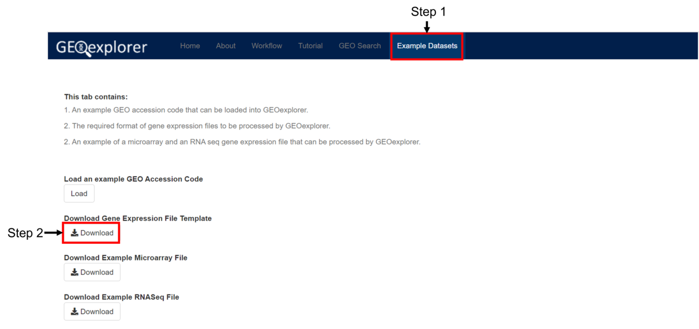

```{r, include = FALSE}
knitr::opts_chunk$set(
  collapse = TRUE,
  comment = "#>"
)
```

# Introduction

GEOexplorer is a web server and R package that enables users to
perform gene expression analysis and explore the results in a range 
of interactive graphs. The development of GEOexplorer was made
possible because of the excellent code provided by [GEO2R](https:
//www.ncbi.nlm.nih.gov/geo/geo2r/).

# Accessing the Web Server

The webserver can be accessed on the following [link](https://geoexplorer.rosalind.kcl.ac.uk/).

# GEOexplorer Tutorial

GEOexplorer splits gene expression analysis into three
distinct processes. 
The first process is exploratory data analysis, which aims 
to gain an overall understanding of the gene expression dataset. 
The second process is differential gene expression analysis, 
which aims to identify the genes that are statistically
upregulated or downregulated between two groups. 
The final process is gene enrichment analysis, which aims to 
provide the biological processes and mechanisms the 
differentially expressed genes are involved in.

## Video Tutorial

It is advised to watch the video tutorial of GEOexplorer,
which is available on the following
[link](https://youtu.be/SziUG8WOlNk). The video
tutorial includes an explanation of how to interpret 
the various results and visualisation.

## GEOexplorer Structure
GEOexplorer contains several tabs, each of which serves a distinct purpose. 
These tabs will be described in the subsections below. 

### Home Tab
The home tab contains all the widgets to perform gene expression analysis.


### About Tab
The about tab contains information about GEOexplorer including links to 
additional documentation.


### GEO Search Tab
The GEO search tab allows you to search for the GEO database for relevant 
datasets to analyse.


### Tutorial Tab
The tutorial tab provides a step by step guide on how to use GEOexplorer.


### Example Datasets Tab
The example datasets tab provides an example GEO dataset, microarray CSV,
RNA seq CSV and template for user uploaded gene expression data.

## Loading Gene Expression Data Into GEOexplorer
There are three main ways that gene expression datasets can be loaded into 
GEOexplorer, which will be described below.

### Using a GEO Accession Code
Step 1: Navigate to the **Home** tab.

Step 2: Input GEO accession code microarray gene expression dataset you wish 
to study. GEOexplorer will automatically download the dataset from GEO. The 
GEO accession code used in this tutorial is **GSE18388**.


### Searching for a GEO dataset
Step 1: Navigate to the **GEO Search** tab.

Step 2: Input the keywords you which to search.

Step 3: Click the **Search** button. A table containing the results will be
loaded. The keywords code used in this tutorial are 
**Microarray Analysis of Space-flown Murine Thymus Tissue**.


Step 4: Click **Load Dataset** for the gene expression dataset you wish to 
load.


### Uploading your own gene expression dataset
Step 1: Navigate to the **Example Datasets** tab.

Step 2: Download the template.


Step 3: Ensure you gene expression data is in the same format as the template.

Step 4: Navigate to the **Home** tab.

Step 5: Click the **Upload** option.


Step 6: Click **Browse**.

Step 7: Select the file you wish to upload.

Step 8: Click **Open**


Step 9: Wait for the file to upload.


## Performing Exploratory Data Analysis
After loading your dataset onto GEOexplorer performing exploratory data 
analysis is the same for all microarray gene expression datasets.
However, there is a slight difference in processing exploratory data analysis.

### Microarray

Step 1: Select the platform you wish to analyse. 
The platform used in this tutorial is **GPL6246**.

Step 2: Select if you want to log transform, not log transform or 
auto-detect if log transformation should be applied to the gene 
expression dataset.

Step 3: Select if you want to fill in missing values using KNN imputation.

Step 4: Click the **Analyse** button.

**Image 1:**


After clicking "Analyse", exploratory data analysis will be completed and the 
results can be reviewed as per the following steps and image 2.

Step 5: Click on the **Dataset Information** tab.

Step 6: Review the information presented in the subtabs, which includes
details of the experiment, details of the experimental conditions and the 
gene expression dataset.

Step 7: After reviewing this information, click on the **Exploratory Data
Analysis** tab.

**Image 2:**


Step 8: Within the **Exploratory Data Analysis** tab, review the 
visualisations in each of the subtabs. The visualisations can be 
divided into four groups:
Group 1: This allows you to identify if the gene expression dataset 
is normalised.
Group 2: Displays the amount of variation within each principal component.
Group 3: This allows you to identify if the gene expression dataset 
contains a large amount of variation.
Group 4: This allows you to identify groups of similar 
experimental conditions.

**Image 3:**


## Performing Differential Gene Expression Analysis

Step 1: After performing exploratory data analysis, click on the
**Differential Gene Expression Analysis** tab, as per the image 1.

**Image 1:**


Note: As part of differential gene expression analysis you will need to 
define two groups of experimental conditions you want to compare, to 
identify the genes that are expressed differently between the two groups.

Step 2: Select the first 4 rows (the space-flown mice) in group 1.

**Image 2:**


Step 3: Select the last 4 rows (the non-space flown mice) in group 2.

Step 4: Select "Benjamini & Hochberg (False discovery rate)" 
for the adjustment to P-value from the drop-down.

Step 5: Select "No" for whether to apply limma precision weights. The limma 
precision weights improve the accuracy of differential gene expression 
analysis when a strong mean-variance trend is present as can be identified 
from the **Mean-Variance Plot** subtab.

Step 6: Select "Yes" to force normalisation.
Forcing normalisation is advisable if the experimental conditions are
not median centred as can be identified from the 
**Box-and-WhisperPlot**, **Expression Density Plot** and 
**3D Expression Density Plot** subtabs.

Step 7: Select "0.05" as the significance level cut off. 
The cut off will be used to identify the genes that are under-expressed 
and the genes that are over-expressed between the two groups.

Step 8: Click the "Analyse" button to perform differential 
gene expression analysis.

**Image 3:**


After clicking analyse, differential gene expression analysis will 
be performed.

Step: 9: Review the results on the following subtabs which can be divided
into the following groups:
Group 1: A table containing the statistics of the top 250 differentially 
expressed genes.
Group 2: Visualisations to indicate if an appropriate P-value adjustment
was used.
Group 3: Visualisations that display the differentially expressed genes.

**Image 4:**


# R Package Installation

GEOexplorer can be installed from Bioconductor:

```{r eval=FALSE}
if (!requireNamespace("BiocManager", quietly = TRUE))
    install.packages("BiocManager")

# The following initializes usage of Bioc devel
BiocManager::install(version='devel')

BiocManager::install("GEOexplorer")
```

Or from GitHub:

```{r eval=FALSE}
if (!requireNamespace("devtools", quietly = TRUE))
  install.packages("devtools")

devtools::install_github("guypwhunt/GEOexplorer")
```

# Launching GEOexplorer from the R package 

GEOexplorer can be launched via the two steps below:

Step 1: Load the package

```{r loadLibrary}
library(GEOexplorer)
```

Step 2: Launch the GEOexplorer web application.

```{r}
loadApp()
```


# Reporting problems or bugs

If you run into problems using GEOexplorer, the [Bioconductor Support
site](https://support.bioconductor.org/) is a good first place to ask
for help. If you are convinced that there is a bug in GEOexplorer, feel
free to submit an issue on the [GEOexplorer github
site](https://github.com/guypwhunt/GEOexplorer). Please include the GEO
accession code or gene expression dataset that errors, the operating system, 
and the browser used.

# Session info

The following package and versions were used in the production of this
vignette.

```{r echo=FALSE}
sessionInfo()
```
